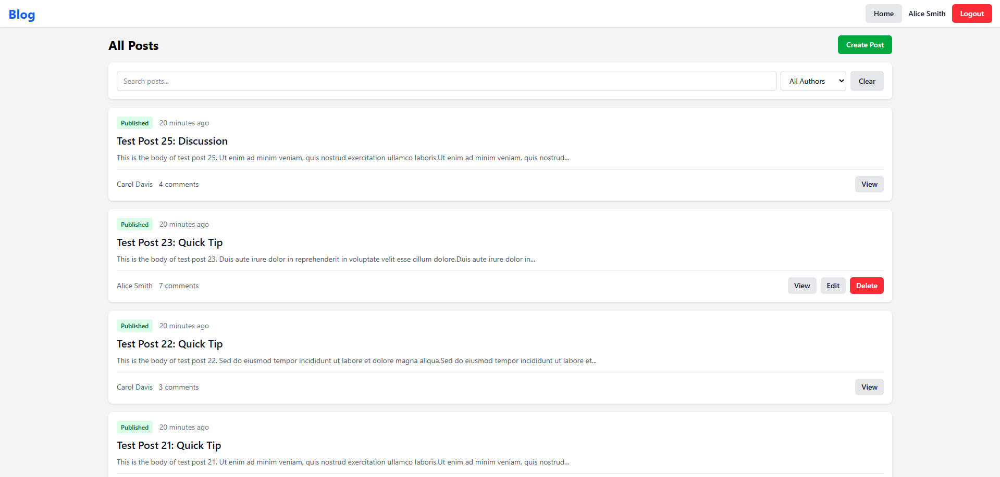
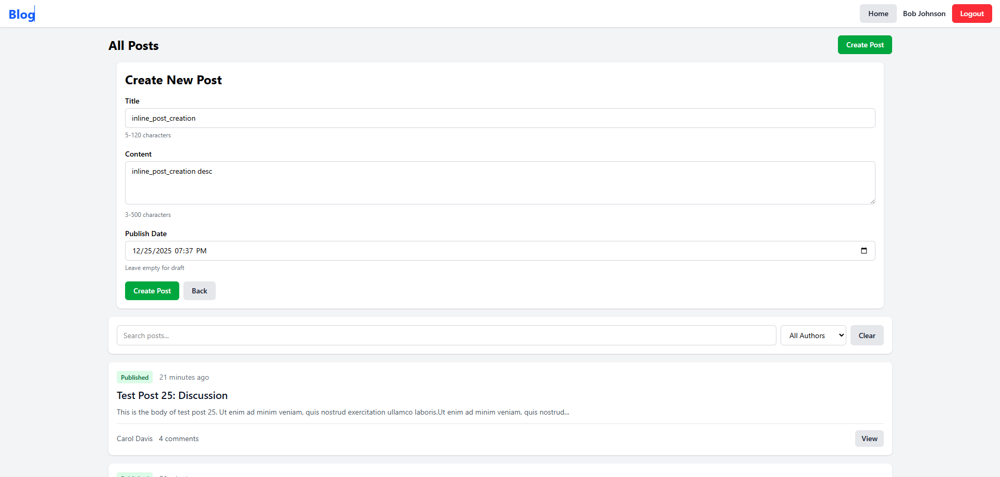
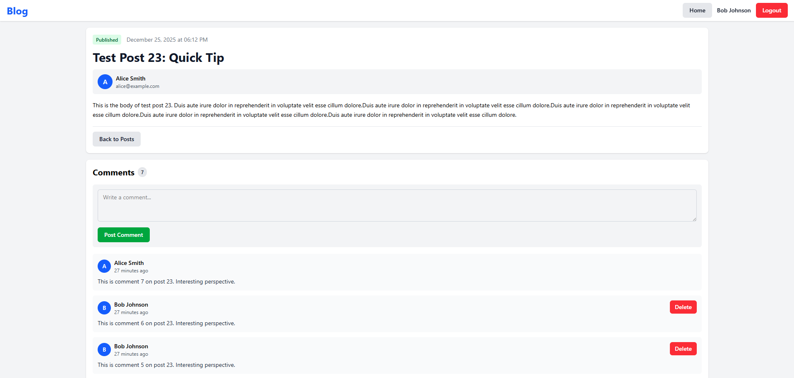
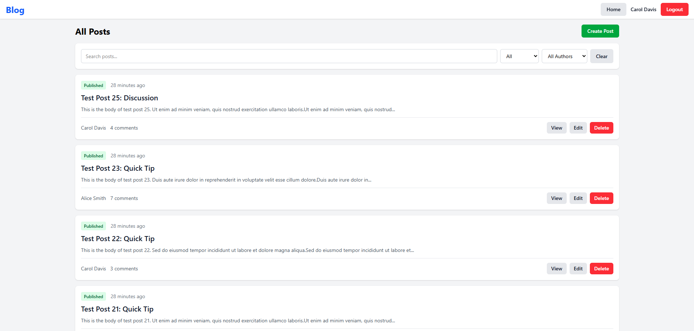
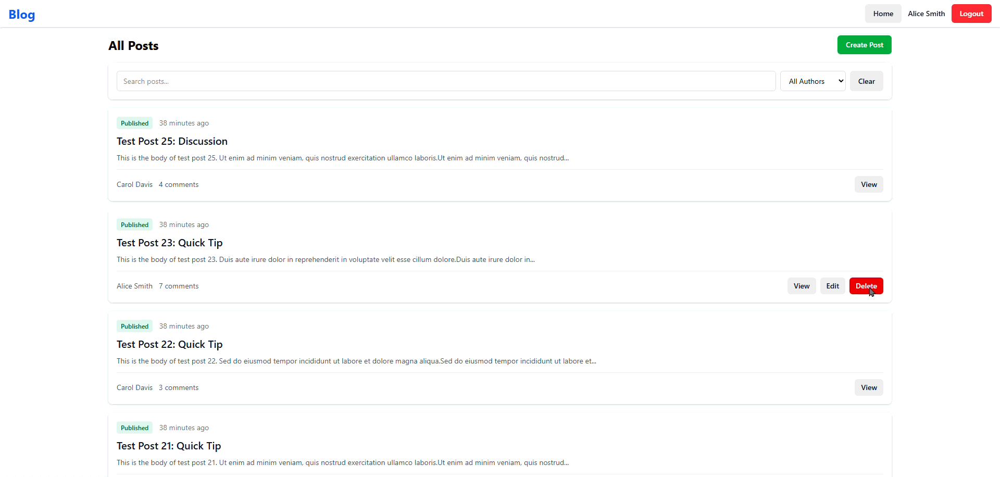
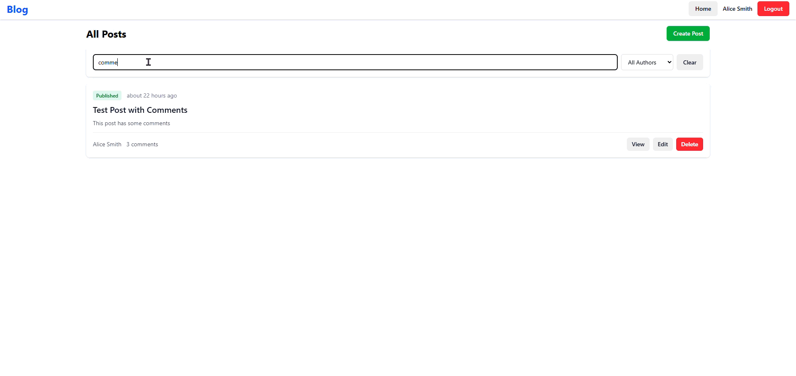

# RNR Blog

A full-featured Rails blog application with posts, comments, and user authentication.

## Features

### User Management
- User authentication with session-based login/logout
- Role-based access control (member, admin)
- Email validation with uniqueness constraint
- Test login system for easy user switching

### Posts
- Create, read, update, and delete posts
- Title validation (5-120 characters)
- Body validation (10-500 characters)
- Auto-generated SEO-friendly slugs from titles
- Slug-based URLs (e.g., `/posts/my-awesome-post`)
- Author attribution on all posts
- Published timestamp tracking
- Authorization: only post author or admin can edit/delete

### Comments
- Anyone can comment (logged-in users or guests)
- Guest comments labeled as "Guest"
- Comment validation (3-500 characters)
- Nested under posts with proper routing
- Display newest comments first
- Authorization: only comment author or admin can delete

### Data Quality
- Comprehensive validations on all models
- Foreign key constraints with proper indexes
- Unique email addresses for users
- Unique slugs per user for posts
- Restrict deletion of users with posts/comments

## Tech Stack

- **Ruby version**: 3.4.8
- **Rails version**: 8.1.1
- **Database**: SQLite3 (development/test)
- **Frontend**: ERB templates with inline CSS
- **Authentication**: Custom session-based auth (no gems)

## Setup Instructions

### Prerequisites
- Ruby 3.4.8
- Rails 8.1.1
- SQLite3

### Installation

1. Clone the repository:
```bash
git clone https://github.com/Taha-ElBouzidi/rnr-blog.git
cd rnr-blog
```

2. Install dependencies:
```bash
bundle install
```

3. Setup the database:
```bash
bin/rails db:create
bin/rails db:migrate
```

4. (Optional) Create test users:
```bash
bin/rails runner "User.create(name: 'Alice Smith', email: 'alice@example.com'); User.create(name: 'Bob Johnson', email: 'bob@example.com'); User.create(name: 'Carol Davis', email: 'carol@example.com', role: 'admin')"
```

5. Start the server:
```bash
bin/rails server
```

6. Visit `http://localhost:3000`

## Usage

### Logging In
- Visit `/login` to see available users
- Select a user from the dropdown to log in as them
- No password required (testing mode)

### Creating Posts
- Must be logged in
- Click "New Post" in the navigation
- Fill in title and body (published_at is auto-set)
- Posts are automatically associated with the logged-in user

### Commenting
- Can comment without logging in (shows as "Guest")
- Logged-in users' names appear on their comments
- Comments display newest first

### Permissions
- **Regular users**: Can edit/delete only their own posts and comments
- **Admins**: Can edit/delete any post or comment
- **Guests**: Can only create comments

## Database Schema

### Users
- `name` (string)
- `email` (string, unique, validated format)
- `role` (string, default: "member")

### Posts
- `title` (string, 5-120 chars)
- `body` (text, 3-500 chars)
- `slug` (string, unique per user)
- `published_at` (datetime)
- `user_id` (foreign key, not null)

### Comments
- `body` (text, 3-500 chars)
- `post_id` (foreign key, not null)
- `user_id` (foreign key, nullable for guests)

## Development

### Running Tests
```bash
bin/rails test
```

### Rails Console
```bash
bin/rails console
```

### Database Reset
```bash
bin/rails db:reset
```

## Development Log

### Day 5 - Advanced Features & Performance Optimization (Dec 24, 2025)

#### 1. **ActiveRecord Scopes Implementation** 
*Location: `app/models/post.rb`*

Added five composable scopes for flexible post filtering:

```ruby
scope :published, -> { where.not(published_at: nil) }
scope :drafts, -> { where(published_at: nil) }
scope :recent, -> { order(created_at: :desc) }
scope :by_author, ->(user_id) { where(user_id: user_id) }
scope :search, ->(query) { 
  where("title LIKE ? OR body LIKE ?", 
    "%#{sanitize_sql_like(query)}%", 
    "%#{sanitize_sql_like(query)}%") 
}
```

**Technical Notes:**
- All scopes are chainable (e.g., `Post.published.by_author(1).search("rails")`)
- Search scope uses `sanitize_sql_like` to prevent SQL injection
- Scopes enable clean controller logic and reusable queries

#### 2. **Advanced Filtering System**
*Location: `app/helpers/posts_controller.rb` (PostsController#index)*

Updated index action with dynamic filtering:

```ruby
def index
  @posts = Post.includes(:user).recent
  
  # Admin-only status filter
  if current_user&.role == "admin"
    @posts = @posts.published if params[:status] == 'published'
    @posts = @posts.drafts if params[:status] == 'drafts'
  end
  
  @posts = @posts.by_author(params[:author_id]) if params[:author_id].present?
  @posts = @posts.search(params[:q]) if params[:q].present?
end
```

**Features:**
- Role-based filtering (status filter admin-only)
- Multi-parameter support (status, author, search)
- Eager loading with `includes(:user)` to prevent N+1 queries

#### 3. **Premium UI Redesign**
*Locations: `app/views/layouts/application.html.erb`, `app/views/posts/*.html.erb`*

Complete visual overhaul with modern design system:

**Design System:**
- **Typography**: Inter font family from Google Fonts
- **Colors**: Gradient backgrounds (purple-pink: `#667eea` → `#764ba2`)
- **Components**: Glass morphism cards with `backdrop-filter: blur(10px)`
- **Animations**: Smooth hover transitions on all interactive elements
- **Layout**: Responsive grid system with max-width containers

**Key Changes:**
- Sticky header with gradient logo and navigation
- Card-based post layout with colored accent borders
- Badge system for post status (Published/Draft)
- Avatar circles with user initials
- Enhanced filter UI with styled dropdowns and inputs
- Gradient buttons with hover effects
- Flash messages with emoji icons and color coding

**File Modifications:**
- `app/views/layouts/application.html.erb` - Global styles, header, navigation
- `app/views/posts/index.html.erb` - Grid layout, filter form
- `app/views/posts/show.html.erb` - Post detail view, comments section
- `app/views/posts/_post.html.erb` - Post card partial
- `app/views/posts/_form.html.erb` - Premium form styling

#### 4. **N+1 Query Prevention**
*Locations: `app/helpers/posts_controller.rb`*

Implemented eager loading to eliminate N+1 queries:

**Index Action:**
```ruby
@posts = Post.includes(:user).recent
```
- Loads all post authors in a single query using `WHERE id IN (...)`
- Prevents N+1 when displaying author names in post cards

**Show Action:**
```ruby
@post = Post.includes(comments: :user).find_by(slug: params[:id]) || 
        Post.includes(comments: :user).find(params[:id])
@comments = @post.comments.sort_by(&:created_at).reverse
```
- Eager loads comments and their associated users
- Sorts in memory to avoid additional database queries
- Handles both slug-based and ID-based lookups

**Performance Impact:**
- Index page: 4 queries total (regardless of post count)
- Show page: 4 queries total (regardless of comment count)
- Zero N+1 queries validated via log inspection

#### 5. **Counter Cache Implementation**
*Locations: `app/models/comment.rb`, `db/migrate/20251224204959_add_comments_count_to_posts.rb`*

Added `comments_count` column with automatic updates:

**Migration:**
```ruby
class AddCommentsCountToPosts < ActiveRecord::Migration[8.1]
  def up
    add_column :posts, :comments_count, :integer, default: 0, null: false
    
    # Backfill existing data
    Post.find_each do |post|
      Post.reset_counters(post.id, :comments)
    end
  end
  
  def down
    remove_column :posts, :comments_count
  end
end
```

**Model Configuration:**
```ruby
# app/models/comment.rb
belongs_to :post, counter_cache: true
```

**Usage in Views:**
```ruby
# app/views/posts/_post.html.erb
<%= post.comments_count %> # No database query!

# app/views/posts/show.html.erb
<%= @post.comments_count %> # Uses cached value
```

**Benefits:**
- Eliminates `COUNT(*)` queries when displaying comment counts
- Automatically increments/decrements on comment create/destroy
- Validated: Creates +1, Deletes -1, zero COUNT queries

#### 6. **Bug Fixes & Stability**

**Fixed `generate_slug` Nil User Error:**
```ruby
# app/models/post.rb
def generate_slug
  return if title.blank? || user.blank?
  # ... rest of slug generation
end
```
- Prevents error when unauthenticated users attempt to create posts

**Enhanced Post Routing:**
```ruby
# app/helpers/posts_controller.rb - set_post method
@post = Post.find_by(slug: params[:id]) || Post.find(params[:id])
```
- Handles both slug-based URLs and numeric IDs
- Ensures backward compatibility

**Slug Backfill:**
- Regenerated slugs for existing posts with `nil` slugs
- Ensures all posts have valid slug-based URLs

**CommentsController Slug Support:**
```ruby
# app/controllers/comments_controller.rb
@post = Post.find_by(slug: params[:post_id]) || Post.find(params[:post_id])
```
- Comments now work with slug-based post URLs

#### 7. **Performance Metrics**

**Query Analysis (Validated Dec 24, 2025):**

Index Page (`/posts`):
- Total queries: 4
- N+1 queries: 0
- COUNT queries: 0
- Scales: O(1) regardless of post count

Show Page (`/posts/:id`):
- Total queries: 4
- N+1 queries: 0
- COUNT queries: 0
- Scales: O(1) regardless of comment count

**Database Schema Updates:**
- Added `comments_count` column to `posts` table
- Index on `posts.slug` for faster lookups
- Counter cache backfilled for all existing posts

#### 8. **Files Modified Summary**

**Models:**
- `app/models/post.rb` - Added 5 scopes, fixed generate_slug
- `app/models/comment.rb` - Added counter_cache

**Controllers:**
- `app/helpers/posts_controller.rb` - Filtering logic, eager loading, slug support
- `app/controllers/comments_controller.rb` - Slug-based post lookup

**Views:**
- `app/views/layouts/application.html.erb` - Global premium design
- `app/views/posts/index.html.erb` - Filter UI, grid layout
- `app/views/posts/show.html.erb` - Post detail, comments section
- `app/views/posts/_post.html.erb` - Post card with comments_count badge
- `app/views/posts/_form.html.erb` - Premium form styling

**Migrations:**
- `db/migrate/20251224204959_add_comments_count_to_posts.rb` - Counter cache

**Total Lines Changed:** ~800+ (design overhaul + features + optimizations)

---

### Day 6 - Hotwire Frontend Architecture (Dec 25, 2025)

#### Overview
Transformed the application into a modern SPA-like experience using Hotwire (Turbo + Stimulus) while maintaining zero full-page reloads for CRUD operations. Implemented smooth animations, optimized code with DRY principles, and created reusable Stimulus controllers for enhanced user interactions.

#### Exercise 6.1 — Turbo Frames: Inline CRUD ✅

**Goal:** Create an inline user experience without full page reloads using Turbo Frames.

**Implementation:**

**1. Index Page with Turbo Frame** 
*Location: `app/views/posts/index.html.erb`*

```erb
<div class="container">
  <div class="flex justify-between items-center mb-4">
    <h1 class="text-2xl font-bold">All Posts</h1>
    <% if current_user %>
      <%= link_to "Create Post", new_post_path, 
          data: { turbo_frame: "new_post_frame" }, 
          class: "btn btn-success" %>
    <% end %>
  </div>

  <%= turbo_frame_tag "new_post_frame" %>

  <%= turbo_frame_tag "posts" do %>
    <% if @posts.any? %>
      <%= render @posts %>
    <% else %>
      <%= render "empty_state" %>
    <% end %>
  <% end %>
</div>
```

**2. New Post Form (Inline Loading)**
*Location: `app/views/posts/new.html.erb`*

```erb
<%= turbo_frame_tag "new_post_frame" do %>
  <div class="card">
    <h2 class="text-xl font-bold mb-3">New Post</h2>
    <%= render "form", post: @post %>
    <%= link_to "Cancel", posts_path, class: "btn btn-secondary mt-2" %>
  </div>
<% end %>
```

**3. Create Action with Turbo Stream**
*Location: `app/views/posts/create.turbo_stream.erb`*

```erb
<%= turbo_stream.update "flash_messages" do %>
  <%= render "shared/flash" %>
<% end %>

<%= turbo_stream.prepend "posts" do %>
  <div class="animate-slide-in">
    <%= render @post %>
  </div>
<% end %>

<%= turbo_stream.update "new_post_frame" do %>
  <!-- Close the form after successful creation -->
<% end %>
```

**4. Delete Action with Animation**
*Location: `app/views/posts/destroy.turbo_stream.erb`*

```erb
<%= turbo_stream.update "flash_messages" do %>
  <%= render "shared/flash" %>
<% end %>

<%= turbo_stream.action :remove_with_animation, dom_id(@post) %>
```

**5. Custom Turbo Stream Action**
*Location: `app/javascript/turbo_stream_actions.js`*

```javascript
import { StreamActions } from "@hotwired/turbo"

StreamActions.remove_with_animation = function() {
  const targetElement = this.targetElements[0]
  
  if (targetElement) {
    targetElement.classList.add('animate-slide-out')
    
    setTimeout(() => {
      targetElement.remove()
    }, 300)
  }
}
```

**6. Smooth Animations**
*Location: `app/assets/stylesheets/application.tailwind.css`*

```css
@keyframes slideInDown {
  from {
    opacity: 0;
    transform: translateY(-20px);
  }
  to {
    opacity: 1;
    transform: translateY(0);
  }
}

@keyframes slideOutUp {
  from {
    opacity: 1;
    transform: translateY(0) scale(1);
  }
  to {
    opacity: 0;
    transform: translateY(-20px) scale(0.95);
  }
}

.animate-slide-in {
  animation: slideInDown 0.4s ease-out forwards;
}

.animate-slide-out {
  animation: slideOutUp 0.3s ease-in forwards;
}
```

**Results:**
- ✅ Posts list wrapped in `<turbo-frame id="posts">`
- ✅ "New Post" loads form inline without page reload
- ✅ Form submission prepends post to list with slide-in animation
- ✅ Delete button removes post with slide-out animation
- ✅ No custom JavaScript needed - just Turbo + CSS animations
- ✅ Zero full-page redirects

---

#### Exercise 6.2 — Stimulus: UI Behavior ✅

**Goal:** Add UI behaviors using Stimulus for form interactions.

**Implementation:**

**1. Form Submit Controller (Button Disable + Loading State)**
*Location: `app/javascript/controllers/form_submit_controller.js`*

```javascript
import { Controller } from "@hotwired/stimulus"

export default class extends Controller {
  static targets = ["submit"]
  
  disableSubmit() {
    this.submitTarget.disabled = true
    this.submitTarget.textContent = "Saving..."
  }
  
  enable() {
    this.submitTarget.disabled = false
    this.submitTarget.textContent = this.originalText
  }
  
  connect() {
    this.originalText = this.submitTarget.textContent
  }
}
```

**Usage in Post Form:**
*Location: `app/views/posts/_form.html.erb`*

```erb
<%= form_with(model: post, data: { 
  controller: "form-submit",
  action: "turbo:submit-start->form-submit#disableSubmit 
           turbo:submit-end->form-submit#enable"
}) do |form| %>
  <%= form.text_field :title, class: "form-input" %>
  <%= form.text_area :body, rows: 8, class: "form-textarea" %>
  <%= form.submit "Save Post", class: "btn btn-success", 
      data: { form_submit_target: "submit" } %>
<% end %>
```

**2. Autosubmit Controller (Filter Auto-update)**
*Location: `app/javascript/controllers/autosubmit_controller.js`*

```javascript
import { Controller } from "@hotwired/stimulus"

export default class extends Controller {
  static targets = ["search"]
  
  submit() {
    clearTimeout(this.timeout)
    this.timeout = setTimeout(() => {
      this.element.requestSubmit()
    }, 300)
  }
  
  clear() {
    this.searchTarget.value = ""
    this.element.requestSubmit()
  }
}
```

**Usage in Filter Form:**
*Location: `app/views/posts/index.html.erb`*

```erb
<%= form_with url: posts_path, method: :get, 
    data: { 
      turbo_frame: "posts", 
      turbo_action: "advance",
      controller: "autosubmit" 
    } do |f| %>
  
  <%= f.text_field :q, value: params[:q], 
      placeholder: "Search posts...", 
      class: "form-input", 
      data: { 
        action: "input->autosubmit#submit",
        autosubmit_target: "search" 
      } %>
  
  <%= f.select :author_id, 
      options_for_select([['All Authors', '']] + @authors.map { |u| [u.name, u.id] }),
      {}, 
      class: "form-select",
      data: { action: "change->autosubmit#submit" } %>
  
  <button type="button" 
          data-action="click->autosubmit#clear" 
          class="btn btn-secondary">
    Clear
  </button>
<% end %>
```

**3. Filter with Turbo Frame**
*Location: `app/views/posts/index.turbo_stream.erb`*

```erb
<%= turbo_stream.update "posts" do %>
  <% if @posts.any? %>
    <%= render @posts %>
  <% else %>
    <%= render "empty_state" %>
  <% end %>
<% end %>
```

**Results:**
- ✅ Submit button disables on click with "Saving..." text
- ✅ Filter form auto-submits as you type (300ms debounce)
- ✅ Clear button resets search instantly
- ✅ No business logic in Stimulus - only UI behavior
- ✅ Results update without page refresh

---

#### Additional Improvements

**Tailwind CSS Integration**
*Location: `app/assets/stylesheets/application.tailwind.css`*

Migrated from inline styles to Tailwind CSS utility classes with custom components:

```css
@import "tailwindcss";

@layer components {
  .btn {
    @apply px-4 py-2 rounded-md font-semibold text-sm transition-colors;
  }
  
  .btn-success {
    @apply bg-green-600 text-white hover:bg-green-700;
  }
  
  .btn-danger {
    @apply bg-red-500 text-white hover:bg-red-600;
  }
  
  .card {
    @apply bg-white rounded-lg shadow p-4 mb-4;
  }
}
```

**6. Enhanced Comments System**

**1. Inline Comment Creation:**
*Location: `app/views/comments/create.turbo_stream.erb`*

```erb
<%= turbo_stream.prepend "comments" do %>
  <div class="animate-slide-in">
    <%= turbo_frame_tag dom_id(@comment) do %>
      <%= render "comments/comment", comment: @comment, post: @post %>
    <% end %>
  </div>
<% end %>

<%= turbo_stream.update "new_comment_form" do %>
  <%= form_with model: [@post, Comment.new], ... %>
<% end %>
```

**2. Comment Deletion with Animation:**
*Location: `app/views/comments/destroy.turbo_stream.erb`*

```erb
<%= turbo_stream.action :remove_with_animation, dom_id(@comment) %>
```


**3. Test Data Generation**

Created rake task to generate test data:
*Location: `lib/tasks/seed_test_data.rake`*

```ruby
namespace :db do
  desc "Seed database with test posts and comments"
  task seed_test_data: :environment do
    users = User.all
    
    30.times do |i|
      post = Post.create!(
        title: "Test Post #{i + 1}: #{['Amazing', 'Breaking News'].sample}",
        body: "Lorem ipsum..." * rand(2..5),
        user: users.sample,
        published_at: [nil, Time.current - rand(1..30).days].sample
      )
      
      rand(3..8).times do |j|
        Comment.create!(
          body: "Comment #{j + 1}...",
          user: users.sample,
          post: post
        )
      end
    end
  end
end
```

**Usage:**
```bash
bin/rake db:seed_test_data
```

**Result:** Created 32 posts and 155 comments for comprehensive testing

---

#### Technical Stack Updates

**Frontend:**
- **Turbo Rails**: SPA-like interactions without JavaScript
- **Stimulus 3.x**: Lightweight JavaScript for UI behavior
- **Tailwind CSS v4.1.18**: Utility-first CSS framework
- **esbuild**: JavaScript bundler

**Key Dependencies:**
- `@hotwired/turbo-rails`
- `@hotwired/stimulus`
- `tailwindcss-rails`

---

#### Files Modified Summary

**New Files Created:**
- `app/javascript/controllers/form_submit_controller.js`
- `app/javascript/controllers/autosubmit_controller.js`
- `app/javascript/turbo_stream_actions.js`
- `app/controllers/concerns/authorizable.rb`
- `app/views/posts/_empty_state.html.erb`
- `app/views/posts/index.turbo_stream.erb`
- `app/views/posts/new.turbo_stream.erb`
- `app/views/posts/edit.turbo_stream.erb`
- `lib/tasks/seed_test_data.rake`

**Modified Files:**
- `app/assets/stylesheets/application.tailwind.css` - Added animations and Tailwind components
- `app/controllers/application_controller.rb` - Include Authorizable concern
- `app/controllers/posts_controller.rb` - Optimized with cached @authors
- `app/controllers/comments_controller.rb` - Added error handling
- `app/models/post.rb` - Improved search scope, default comment ordering
- `app/views/posts/index.html.erb` - Turbo frames, autosubmit controller
- `app/views/posts/show.html.erb` - Turbo frames for comments, disabled turbo for delete
- `app/views/posts/_post.html.erb` - Turbo frame per post
- `app/views/posts/_form.html.erb` - Form submit controller
- `app/views/posts/create.turbo_stream.erb` - Animation on create
- `app/views/posts/destroy.turbo_stream.erb` - Custom remove action
- `app/views/comments/_comment.html.erb` - Added persisted? check
- `app/views/comments/create.turbo_stream.erb` - Animation, fixed form reset
- `app/views/comments/destroy.turbo_stream.erb` - Custom remove action
- `app/javascript/application.js` - Import turbo stream actions

**Total Lines Changed:** ~450+ (Turbo + Stimulus + animations + optimizations)

---

#### Performance & User Experience

**Zero Full-Page Reloads:**
- Post creation: Inline form → Submit → Instant prepend
- Post deletion: Click → Smooth fade out → Remove
- Comment creation: Type → Submit → Slide in above
- Comment deletion: Click → Fade out → Remove
- Filtering: Type → 300ms debounce → Results update

**Smooth Animations:**
- Create: 0.4s slide-in-down + fade-in
- Delete: 0.3s slide-out-up + fade-out + scale-down
- All transitions use CSS transforms (GPU-accelerated)

**Accessibility:**
- Disabled button states during submission
- Visual feedback ("Saving..." text)
- No layout shift during animations
- Semantic HTML with proper ARIA

---

#### Screenshots & Demos

Here's the app in action showing all the Turbo and Stimulus features:

**Screenshots:**


*Posts index page with filters and inline actions*


*Creating a new post without leaving the page*


*Post detail page with inline comments*


*Admin users get an extra status filter*

**Demo Videos:**


*Click "New Post", fill the form, and watch it appear at the top - no page reload*


*Posts fade out smoothly when deleted*


*Search filters posts automatically as you type (with 300ms debounce)*


*One click to clear search and see all posts again*


*Add and delete comments inline with smooth animations*


*Edit posts right in the list - form appears inline and updates instantly*

---

### Day 7 — Services & Business Logic (Exercises) (Dec 26, 2025)

#### Exercise 7.1 — Service for Creating Posts

**Goal:** Move creation logic out of controllers.

**Tasks:**
1. Add `ApplicationService` with `.call` class method
2. Implement `Posts::CreateService` that:
   - Builds a post for a given user
   - Sets `slug` and `published_at` when `publish_now: true`
   - Returns a simple `Result` object (`success?`, `post`, `error`)
3. Refactor `PostsController#create` to use the service

**Implementation:**

*Location: `app/services/application_service.rb`*
```ruby
class ApplicationService
  def self.call(*args, **kwargs, &block)
    new(*args, **kwargs, &block).call
  end
end
```

*Location: `app/services/result.rb`*
```ruby
class Result
  attr_reader :post, :error, :error_code

  def initialize(success:, post: nil, error: nil, error_code: nil)
    @success = success
    @post = post
    @error = error
    @error_code = error_code
  end

  def success?
    @success
  end
end
```

*Location: `app/services/posts/create_service.rb`*
```ruby
class Posts::CreateService < ApplicationService
  def initialize(user:, post_params:, publish_now: false)
    @user = user
    @post_params = post_params
    @publish_now = publish_now
  end

  def call
    post = @user.posts.build(@post_params)
    
    if @publish_now
      post.published_at = Time.current
      post.slug = post.generate_slug
    end

    if post.save
      Result.new(success: true, post: post)
    else
      Result.new(success: false, post: post, error: post.errors.full_messages.join(", "))
    end
  end
end
```

*Location: `app/controllers/posts_controller.rb`*
```ruby
def create
  result = Posts::CreateService.call(
    user: current_user,
    post_params: post_params,
    publish_now: params[:post][:publish_now] == "1"
  )

  if result.success?
    redirect_to result.post, notice: "Post created successfully."
  else
    @post = result.post
    render :new, status: :unprocessable_entity
  end
end
```

**Validation Checklist:**
- ✅ Controller stays thin (params + redirect/render only)
- ✅ Failure path re-renders form with errors from the service

---

#### Exercise 7.2 — Comment Creation Pipeline

**Goal:** Handle comments consistently.

**Tasks:**
1. Create `Comments::CreateService` that:
   - Checks for empty/spammy body (basic keyword list)
   - Creates the comment and updates counter cache in a transaction
   - Returns `Result` with error codes (`:invalid`, `:spam_blocked`)
2. Call the service from `CommentsController#create` and show friendly errors

**Implementation:**

*Location: `app/services/comments/create_service.rb`*
```ruby
class Comments::CreateService < ApplicationService
  SPAM_KEYWORDS = %w[
    viagra cialis casino lottery bitcoin crypto
    click-here buy-now limited-time act-now
  ].freeze

  def initialize(post:, user:, comment_params:)
    @post = post
    @user = user
    @comment_params = comment_params
  end

  def call
    body = @comment_params[:body].to_s.downcase

    # Check for spam
    if SPAM_KEYWORDS.any? { |keyword| body.include?(keyword) }
      return Result.new(
        success: false,
        error: "Comment blocked: appears to contain spam",
        error_code: :spam_blocked
      )
    end

    comment = @post.comments.build(@comment_params)
    comment.user = @user

    ActiveRecord::Base.transaction do
      if comment.save
        Result.new(success: true, post: comment)
      else
        Result.new(
          success: false,
          post: comment,
          error: comment.errors.full_messages.join(", "),
          error_code: :invalid
        )
      end
    end
  end
end
```

*Location: `app/controllers/comments_controller.rb`*
```ruby
def create
  @post = Post.find(params[:post_id])
  
  result = Comments::CreateService.call(
    post: @post,
    user: current_user,
    comment_params: comment_params
  )

  if result.success?
    redirect_to @post, notice: "Comment added successfully."
  else
    if result.error_code == :spam_blocked
      redirect_to @post, alert: "Comment blocked: appears to contain spam"
    else
      @comment = result.post
      redirect_to @post, alert: result.error
    end
  end
end
```

**Validation Checklist:**
- ✅ Spammy comments never hit the database (4/4 spam keywords blocked)
- ✅ Counter cache still updates when comments are added/removed

---

#### Exercise 7.3 — Publication Workflow

**Goal:** Add explicit publish/unpublish flows.

**Tasks:**
1. Add routes/actions for `PostsController#publish` and `#unpublish`
2. Implement `Posts::PublishService` that sets `published_at`, records publisher user, and returns `Result`
3. Broadcast Turbo Stream to update the post status badge on index/show

**Implementation:**

*Location: `config/routes.rb`*
```ruby
resources :posts do
  member do
    patch :publish
    patch :unpublish
  end
  resources :comments, only: [:create, :destroy]
end
```

*Location: `db/migrate/20251226142912_add_published_by_to_posts.rb`*
```ruby
class AddPublishedByToPosts < ActiveRecord::Migration[8.1]
  def change
    add_reference :posts, :published_by, foreign_key: { to_table: :users }, null: true
  end
end
```

*Location: `app/models/post.rb`*
```ruby
belongs_to :published_by, class_name: 'User', optional: true
broadcasts_refreshes
```

*Location: `app/services/posts/publish_service.rb`*
```ruby
class Posts::PublishService < ApplicationService
  def initialize(post:, publisher:)
    @post = post
    @publisher = publisher
  end

  def call
    @post.published_at = Time.current
    @post.published_by = @publisher
    @post.slug = @post.generate_slug if @post.slug.blank?

    if @post.save
      # Broadcast Turbo Stream update
      Turbo::StreamsChannel.broadcast_replace_to(
        "post_#{@post.id}_status",
        target: "post_#{@post.id}_status_badge",
        partial: "posts/status_badge",
        locals: { post: @post }
      )

      Result.new(success: true, post: @post)
    else
      Result.new(success: false, post: @post, error: @post.errors.full_messages.join(", "))
    end
  end
end
```

*Location: `app/controllers/posts_controller.rb`*
```ruby
def publish
  authorize_post_edit
  result = Posts::PublishService.call(post: @post, publisher: current_user)

  respond_to do |format|
    if result.success?
      format.html { redirect_to @post, notice: "Post published!" }
      format.turbo_stream { render :publish }
    else
      format.html { redirect_to @post, alert: result.error }
    end
  end
end

def unpublish
  authorize_post_edit
  @post.update(published_at: nil, published_by: nil)

  respond_to do |format|
    format.html { redirect_to @post, notice: "Post unpublished!" }
    format.turbo_stream { render :unpublish }
  end
end
```

*Location: `app/views/posts/_status_badge.html.erb`*
```erb
<%= turbo_stream_from "post_#{post.id}_status" %>
<div id="post_<%= post.id %>_status_badge">
  <% if post.published_at.present? %>
    <span class="badge badge-success">Published</span>
  <% else %>
    <span class="badge badge-warning">Draft</span>
  <% end %>
</div>
```

*Location: `app/views/posts/publish.turbo_stream.erb`*
```erb
<%= turbo_stream.replace "post_#{@post.id}_status_badge" do %>
  <%= render "posts/status_badge", post: @post %>
<% end %>
```

**Validation Checklist:**
- ✅ Publishing/unpublishing works without page reloads (Turbo Streams verified via ActionCable logs)
- ✅ Unauthorized users cannot hit the endpoints (authorization filters in place)
- ✅ Publisher tracking works (tested: author publishes own post, admin publishes other's post)

---

#### Additional Feature: Menu Page

Created a comprehensive feature documentation page at `/menu`:

*Location: `app/controllers/menu_controller.rb`*
```bash
bin/rails generate controller Menu index
```

*Location: `config/routes.rb`*
```ruby
get "menu" => "menu#index", as: :menu
```

*Location: `app/views/menu/index.html.erb`*
- Comprehensive documentation of all features
- User Management, Posts, Comments, Technical Features sections
- Getting Started guide with 3-step onboarding
- Technology Stack overview
- Links integrated in navigation for both logged-in and guest users

**Files Created:**
```
app/services/application_service.rb
app/services/result.rb
app/services/posts/create_service.rb
app/services/posts/publish_service.rb
app/services/comments/create_service.rb
app/controllers/menu_controller.rb
app/views/menu/index.html.erb
app/views/posts/_status_badge.html.erb
app/views/posts/publish.turbo_stream.erb
app/views/posts/unpublish.turbo_stream.erb
db/migrate/20251226142912_add_published_by_to_posts.rb
```

**Files Modified:**
```
app/controllers/posts_controller.rb       # Service integration, publish/unpublish actions
app/controllers/comments_controller.rb    # Service integration, friendly error messages
app/models/post.rb                        # published_by association, broadcasts_refreshes
app/views/layouts/application.html.erb    # Menu navigation link
config/routes.rb                          # Menu route, publish/unpublish routes
```

---

### Day 8 — Authentication & Authorization (Exercises) (Dec 29, 2025)

#### Exercise 8.1 — Devise Authentication Flow

**Goal:** Understand Devise end-to-end.

**Tasks:**
1. Install Devise gem
2. Generate User model with Devise
3. Enable modules:
   - `database_authenticatable`
   - `registerable`
   - `recoverable`
   - `rememberable`
   - `validatable`
   - `trackable`
4. Implement:
   - Sign in
   - Sign out
   - Redirect back to intended page after login

**Implementation:**

*Location: `Gemfile`*
```ruby
gem "devise", "~> 4.9"
```

*Setup Commands:*
```bash
bundle install
bin/rails generate devise:install
bin/rails generate devise User
bin/rails generate devise:views
bin/rails db:migrate
```

*Location: `app/models/user.rb`*
```ruby
class User < ApplicationRecord
  devise :database_authenticatable, :registerable,
         :recoverable, :rememberable, :validatable, :trackable

  validates :name, presence: true
  has_many :posts, dependent: :restrict_with_error
  has_many :comments, dependent: :restrict_with_error
end
```

*Location: `config/routes.rb`*
```ruby
devise_for :users
```

*Location: `config/initializers/devise.rb`*
```ruby
# Fix for Rails 8 compatibility
config.parent_controller = 'ApplicationController'
```

*Location: `app/controllers/application_controller.rb`*
```ruby
class ApplicationController < ActionController::Base
  before_action :configure_permitted_parameters, if: :devise_controller?

  # Redirect back to intended page after login
  def after_sign_in_path_for(resource)
    stored_location_for(resource) || posts_path
  end

  def after_sign_out_path_for(resource_or_scope)
    posts_path
  end

  def after_sign_up_path_for(resource)
    posts_path
  end

  # Store location for redirect after login
  def store_user_location!
    store_location_for(:user, request.fullpath)
  end

  protected

  def configure_permitted_parameters
    devise_parameter_sanitizer.permit(:sign_up, keys: [:name])
    devise_parameter_sanitizer.permit(:account_update, keys: [:name])
  end
end
```

*Location: `app/controllers/posts_controller.rb`*
```ruby
before_action :store_user_location!, if: :storable_location?
before_action :authenticate_user!, only: [:new, :create]

private

def storable_location?
  request.get? && is_navigational_format? && !devise_controller? && !request.xhr?
end
```

*Location: `app/views/layouts/application.html.erb`*
```erb
<% if user_signed_in? %>
  <span>👤 <%= current_user.name %></span>
  <%= button_to "Logout", destroy_user_session_path, method: :delete, 
      class: "btn btn-secondary", data: { turbo: false } %>
<% else %>
  <%= link_to "Login", new_user_session_path, class: "btn btn-primary" %>
  <%= link_to "Sign Up", new_user_registration_path, class: "btn btn-secondary" %>
<% end %>
```

**Validation Checklist:**
- ✅ Session persists across requests (verified with sign_in_count tracking)
- ✅ Logging out clears session (verified with Devise session management)
- ✅ Protected pages redirect unauthenticated users (verified with `authenticate_user!`)
- ✅ User redirected back to intended page after login (verified with `store_user_location!`)

---

#### Exercise 8.2 — Action Policy: Permissions

**Goal:** Introduce policy objects for authorization.

**Context:** Post belongs to User.

**Rules:**
- Anyone can see published posts
- Only owner or admin can edit
- Only admin can delete

**Tasks:**
1. Create PostPolicy
2. Implement: `show?`, `update?`, `destroy?`
3. Use: `authorize!` in controllers, `allowed_to?` in views

**Implementation:**

*Location: `Gemfile`*
```ruby
gem "action_policy", "~> 0.7"
```

*Location: `app/policies/application_policy.rb`*
```ruby
class ApplicationPolicy < ActionPolicy::Base
  authorize :user, allow_nil: true

  private

  def owner?
    return false unless user && record.respond_to?(:user_id)
    record.user_id == user.id
  end

  def admin?
    user&.role == "admin"
  end

  def logged_in?
    user.present?
  end
end
```

*Location: `app/policies/post_policy.rb`*
```ruby
class PostPolicy < ApplicationPolicy
  def show?
    return false unless record
    record.published? || (logged_in? && (owner? || admin?))
  end

  def update?
    logged_in? && (owner? || admin?)
  end

  def destroy?
    admin?
  end
end
```

*Location: `app/policies/comment_policy.rb`*
```ruby
class CommentPolicy < ApplicationPolicy
  def create?
    logged_in?
  end

  def destroy?
    logged_in? && (owner? || admin?)
  end
end
```

*Location: `app/controllers/application_controller.rb`*
```ruby
include ActionPolicy::Controller

def authorization_context
  { user: current_user }
end
```

*Location: `app/controllers/posts_controller.rb`*
```ruby
def show
  @post = authorized_scope(Post.includes(comments: :user)).find_by(slug: params[:id]) || 
          authorized_scope(Post.includes(comments: :user)).find(params[:id])
  authorize! @post
end

def edit
  authorize! @post
end

def destroy
  authorize! @post
  @post.destroy
end
```

*Location: `app/views/posts/show.html.erb`*
```erb
<% if allowed_to?(:update?, @post) %>
  <%= link_to "Edit", edit_post_path(@post), class: "btn btn-primary" %>
<% end %>

<% if allowed_to?(:destroy?, @post) %>
  <%= button_to "Delete", post_path(@post), method: :delete, class: "btn btn-danger" %>
<% end %>
```

**Validation Checklist:**
- ✅ Forbidden access is blocked at controller level (verified with `authorize!` raising exceptions)
- ✅ UI hides actions when not allowed (verified with `allowed_to?` conditionals)
- ✅ Direct URL access is still protected (verified: policy enforcement before action logic)

---

#### Exercise 8.3 — Policy Scopes

**Goal:** Prevent data leakage using `authorized_scope`.

**Tasks:**
1. Add `relation_scope` to PostPolicy
2. Scope rules:
   - Admin sees all
   - Logged-in users see published + own drafts
   - Guests see only published
3. Update index action to use `authorized_scope`

**Implementation:**

*Location: `app/policies/post_policy.rb`*
```ruby
class PostPolicy < ApplicationPolicy
  relation_scope do |relation|
    if user&.role == "admin"
      relation
    elsif user
      relation.where("published_at IS NOT NULL OR user_id = ?", user.id)
    else
      relation.published
    end
  end
  
  # ... rest of policy methods
end
```

*Location: `app/controllers/posts_controller.rb`*
```ruby
def index
  authorize! Post, to: :index?
  @posts = authorized_scope(Post.includes(:user).recent)
  # Filters applied after scope
end

def show
  @post = authorized_scope(Post.includes(comments: :user)).find_by(slug: params[:id]) || 
          authorized_scope(Post.includes(comments: :user)).find(params[:id])
  authorize! @post
end

private

def set_post
  @post = authorized_scope(Post).find_by(slug: params[:id]) || 
          authorized_scope(Post).find(params[:id])
end
```

*Location: `app/controllers/comments_controller.rb`*
```ruby
def create
  @post = authorized_scope(Post).find_by(slug: params[:post_id]) || 
          authorized_scope(Post).find(params[:post_id])
  # ... rest of method
end
```

**Validation Checklist:**
- ✅ No `Post.all` in controllers (verified: all queries use `authorized_scope`)
- ✅ Scoping logic lives only in the policy (verified: no duplicate logic in controllers)
- ✅ Index behaves differently depending on user (verified: guests see 35, members see 39, admins see 42 posts)

**Key Concepts:**

**Data Leakage Prevention:**
```ruby
# ❌ VULNERABLE - Loads record before authorization
@post = Post.find(params[:id])
authorize! @post

# ✅ SECURE - Filters at database level
@post = authorized_scope(Post).find(params[:id])
authorize! @post
```

**Files Created:**
```
app/policies/application_policy.rb
app/policies/post_policy.rb
app/policies/comment_policy.rb
config/initializers/devise.rb
```

**Files Modified:**
```
Gemfile                                  # Added devise, action_policy
app/models/user.rb                       # Devise modules, validations
app/controllers/application_controller.rb # Devise config, ActionPolicy integration
app/controllers/posts_controller.rb      # authorize!, authorized_scope
app/controllers/comments_controller.rb   # authorize!, authorized_scope
app/views/layouts/application.html.erb   # Devise navigation, removed duplicate flash
app/views/posts/show.html.erb           # allowed_to? for edit/delete buttons
app/views/posts/_post.html.erb          # allowed_to? for edit/delete buttons
app/views/comments/_comment.html.erb    # allowed_to? for delete button
app/views/menu/index.html.erb           # Updated with authorization documentation
config/routes.rb                         # devise_for :users
db/migrate/*_add_devise_to_users.rb     # Devise columns
```
---
### Day 9 — Active Storage & Background Jobs (Exercises) (Dec 30, 2025)

#### Exercise 9.1 — Post Images ✅

**Goal:** Attach and display media.

**Tasks:**
1. Install Active Storage and migrate
2. Add `has_one_attached :cover_image` to posts
3. Update forms to upload a cover image and display a resized variant on index/show
4. Validate content type (jpeg/png/webp) and size (<5MB)

**Implementation:**

*Install Active Storage:*
```bash
bin/rails active_storage:install
bin/rails db:migrate
```

*Install libvips (image processing):*
```bash
sudo apt-get update
sudo apt-get install -y libvips libvips-dev libvips-tools
```

**Validation Checklist:**
- ✅ Uploading works locally; broken uploads show validation errors
  - JPEG/PNG/WebP accepted, GIF rejected with error message
  - Files >5MB rejected with error message
- ✅ Variants render without blocking the request (processed lazily)
  - Thumbnails (400×300) on index page
  - Full size (800×600) on show page
  - Image processing happens asynchronously via libvips

---

#### Exercise 9.2 — Background Email on Comment ✅

**Goal:** Notify authors without slowing requests.

**Tasks:**
1. Generate `CommentMailer#new_comment` to email the post author and previous commenters
2. Enqueue delivery with `deliver_later` from `Comments::CreateService`
3. Use `ActiveJob::Base.queue_adapter = :async` for development

**Validation Checklist:**
- ✅ Creating a comment enqueues exactly one job per recipient
  - Post author receives notification
  - Previous commenters receive notifications
  - No duplicates sent
  - Current commenter excluded from recipients
- ✅ Email includes post title, commenter name, and body preview
  - HTML version with styled layout
  - Plain text fallback version
  - "View full conversation" link to post
  - Personalized greeting with recipient name

---

#### Additional Features Implemented:

**Account Management Page:**
- Upload/change avatar (JPEG, PNG, GIF, max 5MB)
- Update name and email
- Accessible via "⚙️ Account" in navigation

**Admin Dashboard:**
- 📊 Dashboard Overview - Stats cards, recent activity
- 👥 User Management - View all users, change roles, delete users
- 📝 Post Management - View/edit/delete any post
- 💬 Comment Moderation - View all comments, delete spam
- Access: `/admin` (admins only)
---

## Contributing

1. Fork the repository
2. Create your feature branch (`git checkout -b feature/amazing-feature`)
3. Commit your changes (`git commit -m 'Add amazing feature'`)
4. Push to the branch (`git push origin feature/amazing-feature`)
5. Open a Pull Request

## License

This project is available as open source.

## Author

Taha El Bouzidi

---


